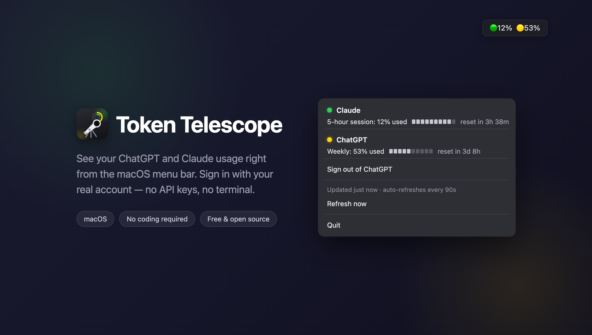

# Token Telescope — widget de barra de menú para el uso de ChatGPT y Claude

🌐 [English](README.md) · [中文](README.zh.md) · **[Español](README.es.md)**



Un pequeño widget siempre activo en la barra de menú de macOS que
muestra cuánto has usado de tu suscripción de ChatGPT y Claude, y
cuándo se restablece. Sin claves de API, sin terminal — inicia sesión
con tu cuenta real como en cualquier otra app.

## Diseñado para ser ligero

Esta app hace una sola cosa — uso de suscripción de ChatGPT + Claude
— y no estorba. Sin Electron, sin runtime empaquetado, sin un
framework de 80 proveedores: solo `rumps` (una envoltura nativa muy
delgada sobre AppKit) y la biblioteca estándar de Python.

| | Token Telescope | [CodexBar](https://github.com/steipete/CodexBar) |
|---|---|---|
| Tamaño instalado | **34 MB** | 171 MB |
| Tamaño de descarga | **16.5 MB** | 70.9 MB |
| macOS mínimo | **11.0 (Big Sur)** | 14.0 (Sonoma) |
| Proveedores | 2 (ChatGPT, Claude) | 80+ |

*(Los números de CodexBar son de su versión universal para macOS
v0.64.1 — cubre más de 80 proveedores y hace mucho más que esta app;
la diferencia de tamaño refleja ese alcance, no es una crítica a
CodexBar. Si necesitas cobertura amplia de muchos proveedores,
CodexBar es la mejor opción. Si solo usas ChatGPT y Claude y quieres
la huella más pequeña posible, esta app es para eso.)*

## Qué muestra

- **Claude** — tu porcentaje de uso en la sesión de 5 horas y el
  tiempo hasta que se restablezca
- **ChatGPT** — tu porcentaje de uso semanal y el tiempo hasta que
  se restablezca
- Un indicador de color (🟢 mucho margen · 🟡 se está agotando ·
  🔴 casi agotado)

## Instalación (no requiere programar)

1. Descarga el `Token Telescope.dmg` más reciente desde
   [Releases](../../releases/latest).
2. Ábrelo y arrastra **Token Telescope.app** a tu carpeta de
   Aplicaciones.
3. Haz doble clic para abrirlo. macOS te avisará que es de un
   desarrollador no identificado (la app no está notarizada por
   Apple) — solo tienes que hacer **clic derecho en la app → Abrir →
   Abrir** una vez para permitirlo. Esta es la forma estándar y
   segura de abrir cualquier app independiente que no haya pagado
   por la notarización de Apple.
4. Una breve **guía de bienvenida** te acompaña paso a paso para
   conectar tus cuentas de ChatGPT y Claude — solo sigue las
   instrucciones en pantalla (puedes omitir cualquiera de las dos y
   conectarla más tarde). Repítela cuando quieras desde el menú →
   "Show Welcome Guide…".

## Conectando tus cuentas

- **ChatGPT**: haz clic en el ítem de la barra de menú →
  **Sign in with ChatGPT** → tu navegador abrirá la página de
  inicio de sesión real de OpenAI → inicia sesión normalmente →
  listo. Esto usa el mismo flujo OAuth público que usa el propio
  Codex CLI de OpenAI — tu contraseña solo la ve OpenAI, nunca esta
  app.
- **Claude**: si ya tienes la [app de escritorio de Claude](https://claude.ai/download)
  instalada y con sesión iniciada, este widget la detecta
  automáticamente. (No hay un botón "Sign in with Claude" a
  propósito — los Términos de Servicio para consumidores de
  Anthropic restringen el uso del cliente OAuth de Claude Code fuera
  de Claude Code/claude.ai, así que esta app respeta eso en lugar de
  evadirlo.)

## Privacidad

Esta app solo se comunica con los propios servidores de OpenAI y
Anthropic, usando tu propia sesión ya iniciada. No se envía nada a
ningún otro lugar, y no se sube nada al desarrollador de esta app.
El código fuente es completamente abierto — revisa `providers/` para
ver exactamente qué hace cada solicitud.

Lo único que esta app escribe en disco por sí misma es una pequeña
caché (por ahora, solo un ID de organización de Claude descubierto,
unos pocos bytes) en `~/.ai-usage-widget/`. Haz clic en el ítem de la
barra de menú para ver la línea **"App X MB · Cache Y B"** — el
tamaño total instalado más esa caché — y usa **Clear Cache** para
borrarla cuando quieras; esto no cierra tu sesión en ninguno de los
dos proveedores.

## Compilar desde el código fuente

Requiere Python 3.11 o superior.

```bash
python3 -m venv .venv
.venv/bin/pip install rumps pycryptodome requests certifi pyinstaller
.venv/bin/pyinstaller --noconfirm "Token Telescope.spec"
open "dist/Token Telescope.app"
```

O ejecútalo directamente sin empaquetar:

```bash
.venv/bin/python app.py
```

## Cómo funciona (notas técnicas)

- **ChatGPT**: OAuth por navegador (PKCE, callback local en
  `localhost:1455`) contra `auth.openai.com`, usando el mismo
  client ID público que usa Codex CLI. Los tokens se guardan en
  `~/.codex/auth.json` (el mismo archivo que usa Codex CLI) y se
  refrescan automáticamente. El uso se lee desde el propio endpoint
  `wham/usage` de ChatGPT — los mismos datos que te muestra la
  interfaz oficial de ChatGPT.
- **Claude**: lee la cookie de sesión de Claude.app, protegida por
  el Llavero de macOS (elemento `"Claude Safe Storage"`), para
  llamar al mismo endpoint privado de uso que usa la propia interfaz
  de Claude.app. Esto es no oficial y podría dejar de funcionar si
  Anthropic cambia detalles internos de su frontend.

Ambas integraciones usan **tu propia sesión ya autenticada** — esta
app no conoce ni almacena tu contraseña de ninguno de los dos
proveedores.

## Limitaciones conocidas

- No está notarizada por Apple (ver el paso 3 de instalación para
  la solución).
- El soporte de Claude depende de que Claude.app esté instalada y
  con sesión iniciada; el soporte de ChatGPT funciona de forma
  independiente mediante inicio de sesión por navegador.
- Ambos endpoints de uso son no oficiales/privados y ni OpenAI ni
  Anthropic garantizan su estabilidad.

## Historial de versiones

Consulta [CHANGELOG.md](CHANGELOG.md) para ver las notas de cada versión.

## Licencia

Para uso personal. No afiliado con OpenAI ni Anthropic.
